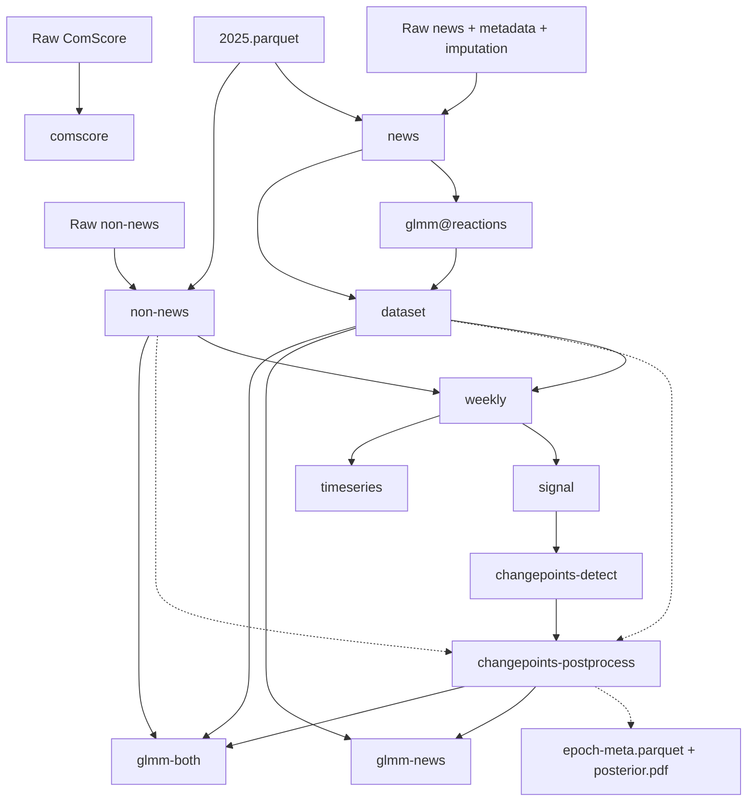

# DVC pipeline reference

[Wiki index](README.md) | [Data contracts](data-contracts.md) | [Development](development-and-reproducibility.md)

## Active graph

[dvc.yaml](../dvc.yaml) defines 12 active stages after expanding `glmm` over
`[reactions]` into `glmm@reactions`. Every declared output uses `persist: true`:
it is retained rather than cleaned before a stage rerun, but the stage command
can still overwrite it. Persistence does not establish freshness or correctness.

Solid arrows below are declared data dependencies. Dotted arrows are additional
reads/writes in the running scripts that are absent from DVC declarations.
Each stage also declares its own script as a dependency. Notebook consumers
are documented separately in [analyses and outputs](analyses-and-outputs.md).

The ComScore branch is independent of the modeling DAG. The Statista DVC pointer
is a standalone tracked input for a notebook, not a pipeline stage dependency.

## Stage commands and interfaces

All commands run from the repository root. In the table, `raw/` and `proc/`
mean `data/raw/` and `data/proc/`; model paths are repository-relative. Listed
inputs are **declared data dependencies**, in addition to each linked script.

| Stage | Command / source | Declared inputs | Declared outputs |
|---|---|---|---|
| `news` | `python stages/make_news.py` ([source](../stages/make_news.py)) | `raw/news-us.parquet`, `raw/metadata.parquet`, `raw/imputed-reactions.parquet`, `raw/2025.parquet` | `proc/news.parquet`, `proc/counts.parquet` |
| `glmm@reactions` | `Rscript stages/glmm_reactions.R` ([source](../stages/glmm_reactions.R)) | `proc/news.parquet` | `models/glmm/reactions` directory (`main.rds`) |
| `dataset` | `Rscript stages/make_dataset.R` ([source](../stages/make_dataset.R)) | `proc/news.parquet`, `models/glmm/reactions` | `proc/dataset.parquet` |
| `non-news` | `python stages/make_nonnews.py` ([source](../stages/make_nonnews.py)) | `raw/non-news-us.parquet`, `raw/2025.parquet` | `proc/non-news.parquet` |
| `comscore` | `python stages/make_comscore.py` ([source](../stages/make_comscore.py)) | `raw/comscore.parquet` | `proc/comscore.parquet` |
| `weekly` | `python stages/make_weekly.py` ([source](../stages/make_weekly.py)) | `proc/dataset.parquet`, `proc/non-news.parquet` | `proc/weekly.parquet`, `proc/weekly-non-news.parquet` |
| `signal` | `python stages/make_signal.py` ([source](../stages/make_signal.py)) | `proc/weekly.parquet` | `proc/signal.parquet` |
| `changepoints-detect` | `Rscript stages/changepoints_detect.R` ([source](../stages/changepoints_detect.R)) | `proc/signal.parquet` | `proc/beast.parquet` |
| `changepoints-postprocess` | `python stages/changepoints_postprocess.py` ([source](../stages/changepoints_postprocess.py)) | `proc/beast.parquet` | `proc/changepoints.parquet`, `proc/epochs.parquet` |
| `timeseries` | `python stages/make_timeseries.py` ([source](../stages/make_timeseries.py)) | `proc/weekly.parquet`, `proc/weekly-non-news.parquet` | `proc/timeseries.parquet` |
| `glmm-news` | `Rscript stages/glmm_news.R` ([source](../stages/glmm_news.R)) | `proc/epochs.parquet`, `proc/dataset.parquet` | `models/glmm/news` directory (`main.rds`) |
| `glmm-both` | `Rscript stages/glmm_both.R` ([source](../stages/glmm_both.R)) | `proc/dataset.parquet`, `proc/epochs.parquet`, `proc/non-news.parquet` | `models/glmm/both` directory (`quality.rds`) |

## Declared parameters

| Stage | `params.yaml` keys declared to DVC |
|---|---|
| `news` | `data` |
| `non-news` | `data.author`, `data.usecols` |
| `comscore` | `comscore` |
| `changepoints-detect` | `changepoints.subsets`, `changepoints.beast` |
| `changepoints-postprocess` | `changepoints.timescale`, `changepoints.peaks`, `changepoints.subsets`, `changepoints.use`, `epochs` |
| `glmm@reactions`, `dataset`, `weekly`, `signal`, `timeseries`, `glmm-news`, `glmm-both` | None |

All stages import shared configuration through `project`. A value being
available to a script does not mean DVC tracks it as a parameter dependency.

## Tracking boundaries

These are differences between the reviewed declarations and implementation,
not changes made by this documentation work:

- `changepoints-postprocess` reads `dataset.parquet` for time bounds and reads
  both `dataset.parquet` and `non-news.parquet` for post-to-epoch assignment.
  Neither is a declared direct dependency. Transitive dependency paths do not
  describe these reads explicitly or guarantee scheduling against the current
  non-news output in every targeted execution.
- That stage also writes `data/proc/epoch-meta.parquet` and
  `figures/changepoints/posterior.pdf`, neither declared as an output. Missing
  epoch metadata can break notebooks even when declared outputs are current;
  DVC cannot restore it as a tracked output of this stage.
- `signal` consumes `signal.groups` without a `params` declaration. Model fits
  consume `parallel.maxcores` without tracking it. Paths and the shared bridge
  are not declared stage dependencies, and environment/package versions are
  not tracked as stage inputs. Evaluate affected stages explicitly when these
  change; `dvc status` only reports the dependencies it knows about.
- Ingestion uses `news-*.parquet` and `non-news-*.parquet` globs, while DVC
  declares only the current US files. Adding another matching file changes
  runtime inputs without automatically extending the declared graph.
- Quarto computations, event annotations, and notebook spreadsheet/figure
  outputs are outside the DVC DAG. A stage-only reproduction is not a complete
  reproduction of every publication artifact.

The inventory above remains the operational contract reference. The
[DVC concern](concerns/reproducibility.md#dvc-declaration-coverage) records what
verification would resolve these omissions; notebook interfaces and artifact
synchronization have separate entries in the same register.

## Active versus historical state

The reviewed [dvc.lock](../dvc.lock) retains entries such as `posts`,
`changepoints`, `glmm-changepoints`, `glmm-changepoints-basic`,
`labels@political`, `labels@negativity`, `daily`, `clusters`, `glmm-non-news`,
and `algo-changes` alongside current stages. Some refer to old `scripts/`
paths and artifacts. They do not create executable stages in the current YAML.
Do not reconstruct the current DAG from all lock entries or remove them as an
incidental documentation cleanup.

[stages/beast.R](../stages/beast.R) similarly reads a bare `dataset.parquet`,
contains exploratory 10-run loops and an external `Y` reference, and writes CSV
files. It is not invoked by `changepoints-detect`, which has its own complete
implementation. The active pipeline is identified by YAML and the successful
`dvc stage list` inspection, not by every historical file or comment.

## Execution implications

`dvc repro glmm-news` includes changed dependencies, not just one R invocation.
The preliminary fit and 1,000 BEAST runs per subset make even a targeted rerun
potentially substantial. Inspect status, required extra artifacts, and existing
processes before reproduction. An active DVC lock is evidence of concurrent
work, not permission to delete the lock. See the
[development guide](development-and-reproducibility.md) for commands and limits.
