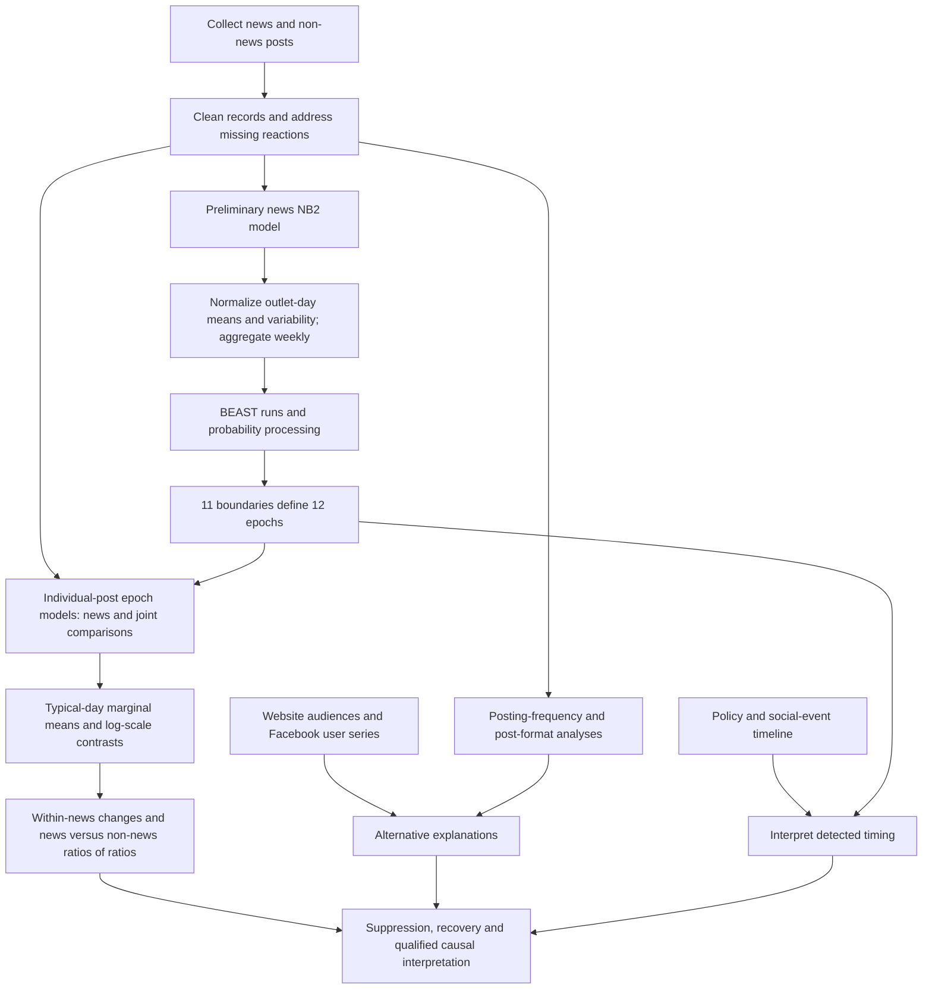

# Article overview

[Manuscript guide](README.md) · [Detailed results](results/suppression-and-recovery.md) · [Interpretation](interpretation-and-limitations.md)

## Question and motivation

The article asks how Facebook's algorithmic policies changed the visibility of
news over 2016–2025: whether the “War on News” reduced news engagement, whether
the subsequent reversal restored it, and whether low-, medium- and high-quality
outlets experienced different changes. Its central empirical outcome is
**reactions per post**, used as a proxy for visibility. The study does not observe
all users' news exposure directly. Sources: abstract and §1,
[pp. 1–2](../manuscript/manuscript.pdf#page=1); Appendix B.2,
[p. 18](../manuscript/manuscript.pdf#page=18).

The authors frame platforms as gatekeepers because their recommendation systems
influence which information users encounter. They describe earlier research as
concentrating on individual policy changes, short windows or single outlets,
leaving cumulative effects, gradual deployment, behavioral feedback and the 2025
reversal insufficiently understood. The cited literature supplies that motivation
and examples; this guide does not independently evaluate those studies. Source:
§1, [pp. 1–2](../manuscript/manuscript.pdf#page=1).

## Claimed contributions and design

The introduction claims three contributions: a decade-long causal account
covering both suppression and reversal; an assessment of heterogeneous effects
across outlet quality; and comparisons with content supply, non-news content and
external audience indicators to distinguish algorithmic effects from other
changes. These are the authors' claims. Their causal interpretation depends on
the observational comparisons and assumptions described in
[causal comparisons](methods/causal-comparisons.md). Source: §1,
[p. 2](../manuscript/manuscript.pdf#page=2).

The news sample contains **5,728,502 posts**, **9,123,838,908 reactions** and
**40 U.S. outlets**, observed from January 1, 2016 through December 16, 2025.
The comparison sample contains **436,420 posts**, **2,270,806,517 reactions**
and **21 non-news pages**. Outlet quality is an outlet-level classification,
not a rating of every individual post. The outlet sample is purposefully selected,
and the authors explicitly decline to treat it as a representative probability
sample of all news posts. Sources: §§1, 4.1–4.3,
[pp. 1–2](../manuscript/manuscript.pdf#page=1),
[pp. 8–9](../manuscript/manuscript.pdf#page=8).

## Analytical workflow

The diagram summarizes the manuscript's analytical dependencies. The detailed
pages preserve procedural order, formulas and unresolved descriptions, including
the two accounts of missing-reaction imputation. Sources: §§4.1–4.4,
[pp. 8–11](../manuscript/manuscript.pdf#page=8); Appendices B, E–K,
[pp. 17–38](../manuscript/manuscript.pdf#page=17).

1. **Establish the sample and measurements.** Sotrender collection is supplemented
   with Facebook Content Library records. Cleaning, quality assignments and
   missing-reaction handling precede the analyses; reactions–views comparisons
   support the proxy choice. See [sampling](data/sampling-and-collection.md),
   [measurement](data/measurement-and-quality.md) and
   [cleaning](data/cleaning-and-imputation.md). Sources: Appendices A–B,
   [pp. 14–18](../manuscript/manuscript.pdf#page=14).
2. **Construct engagement signals.** A preliminary negative binomial model
   provides outlet-day conditional means and variances. Means are normalized
   by outlet averages and variability by conditional means; aggregation produces
   weekly signals for changepoint detection. This preliminary model has the
   quadratic NB2 variance, unlike the final epoch models. Source: §4.2 and
   Appendix E, [p. 9](../manuscript/manuscript.pdf#page=9),
   [p. 22](../manuscript/manuscript.pdf#page=22).
3. **Detect boundaries before interpreting events.** BEAST is repeated 1,000
   times and the resulting probabilities are processed into selected peaks and
   interval estimates. Eleven boundaries define epochs 0–11. Public announcements
   and social events then contextualize these boundaries; they do not define
   them. See [signals and changepoints](methods/engagement-signals-and-changepoints.md)
   and the [epoch calendar](reference/epochs-and-policy-context.md). Sources:
   §4.2/Appendix F, [pp. 8–9](../manuscript/manuscript.pdf#page=8),
   [pp. 23–25](../manuscript/manuscript.pdf#page=23).
4. **Estimate epoch differences at the post level.** News-only and joint
   news/non-news mixed models use the linear NB1 variance. Outlet and time
   effects address heterogeneity; typical-day conditioning and outlet variance
   corrections produce the reported marginal means. Overall news averages
   quality tiers equally on the log scale. See
   [epoch models](methods/epoch-regression-models.md) and
   [marginal means](methods/marginal-means-and-contrasts.md). Sources: §4.3 and
   Appendices G–H, [pp. 9–10](../manuscript/manuscript.pdf#page=9),
   [pp. 26–32](../manuscript/manuscript.pdf#page=26).
5. **Compare changes and consider alternatives.** Within-group ratios describe
   changes; ratios of those ratios compare news with non-news. Posting models,
   website audiences, platform user counts and format analyses address different
   explanations. Their combined interpretation is stronger than any single
   timing match, but remains conditional on the study's assumptions and coverage.
   Sources: §§2.1–3, 4.4 and Appendices D, I–K,
   [pp. 5–8](../manuscript/manuscript.pdf#page=5),
   [pp. 10–11](../manuscript/manuscript.pdf#page=10),
   [p. 21](../manuscript/manuscript.pdf#page=21),
   [pp. 33–38](../manuscript/manuscript.pdf#page=33).

## Main story and numerical landmarks

The main temporal pattern is a decline in news reactions after the 2021 policy
announcement, a trough in epoch 8, and recovery beginning around the 2024 election
and continuing in 2025. The authors interpret the sequence as suppression and
partial restoration of news visibility. Their selected pre-suppression reference
is epoch 4, April 6, 2020–March 1, 2021; the trough is epoch 8, June 26,
2023–September 2, 2024; and the final interval is epoch 11, September 22–December
16, 2025. Sources: §2, Table G.9 and Appendix I,
[pp. 3–5](../manuscript/manuscript.pdf#page=3),
[p. 29](../manuscript/manuscript.pdf#page=29),
[pp. 33–34](../manuscript/manuscript.pdf#page=33).

| Headline | What is compared | Statistical qualification |
|---|---|---|
| **77% decline** | Overall news reactions per post in epoch 8 versus epoch 4: ratio 0.23. | Figure I.9c gives 95% CI [0.16, 0.33], p printed 0.000. |
| **379% recovery** | Overall news in epoch 11 versus epoch 8: ratio 4.79. | CI [3.35, 6.84], p printed 0.000. This is recovery from the trough. |
| **11% above the earlier level** | Overall news in epoch 11 versus epoch 4: ratio 1.11. | CI [0.80, 1.52], p = 0.536; the increase is not statistically established. |
| **70% remaining shortfall** | News 11/4 ratio divided by the non-news 11/4 ratio: 0.30. | CI [0.17, 0.53], p printed 0.000; counterfactual reading requires the comparison assumptions. |
| **83% high-quality shortfall** | High-quality news 11/4 ratio divided by the non-news 11/4 ratio: 0.17. | CI [0.07, 0.38], p printed 0.000; different from the high tier's change against its own earlier level. |

Source: Figure I.9c, [p. 34](../manuscript/manuscript.pdf#page=34).
Printed 0.000 denotes rounded output, not an exactly zero probability. Full
estimates and model distinctions are in
[suppression and recovery](results/suppression-and-recovery.md).

All tiers decline during suppression and recover from the trough. Medium-quality
outlets show the strongest net increase against epoch 4; high-quality outlets
remain below their own earlier level, although that particular 11/4 contrast has
p = 0.060. These within-tier changes must be distinguished from omnibus evidence
of differences between tiers. Appendix K further qualifies the quality narrative:
in its outlet-level regression, quality is not statistically significant after
conditioning on final-epoch link share and primary medium, while link share is
negatively associated with recovery. Sources: Figures 2–3 and I.9c,
[pp. 4–5](../manuscript/manuscript.pdf#page=4),
[p. 34](../manuscript/manuscript.pdf#page=34); Table K.13,
[p. 37](../manuscript/manuscript.pdf#page=37).

## What each main figure contributes

| Figure | Role in the argument | How to read it |
|---|---|---|
| **1**, [p. 3](../manuscript/manuscript.pdf#page=3) | Descriptive motivation: posting and reactions follow different trajectories. | Weekly post and mean-reaction series for tiers and non-news, smoothed with a four-week rolling mean; event markers contextualize time. These are not the final regression estimates. |
| **2**, [p. 4](../manuscript/manuscript.pdf#page=4) | Links detected boundaries to modeled news outcomes and tier differences. | Panel a shows normalized engagement and boundaries; b shows epoch means, outlet points and sequential/grand-mean contrasts; c compares tiers with their geometric mean and indicates omnibus tests. |
| **3**, [p. 5](../manuscript/manuscript.pdf#page=5) | Makes suppression, rebound and net change legible. | Ratios for 8/4, 11/8 and 11/4, overall and by tier. Its within-group changes do not by themselves adjust for non-news growth. |
| **4**, [p. 6](../manuscript/manuscript.pdf#page=6) | Introduces the non-news counterfactual comparison. | Joint-model news and non-news means; interaction contrasts compare each epoch with the geometric baseline over epochs 0–4. This baseline differs from Figure 3's epoch-4-only reference. |

## Interpretation to carry into later work

The study's conclusion is that algorithmic governance substantially suppressed
news engagement and that recovery left news, particularly high-quality outlets,
behind the non-news counterfactual. The measured evidence concerns reactions and
selected outlet comparisons. Effects on exposure, democratic knowledge,
misinformation susceptibility or public opinion are broader implications rather
than measured outcomes. Read the
[interpretation and limitations](interpretation-and-limitations.md) before using
the manuscript's causal language, and the
[reading notes](reference/reading-notes.md) before reconstructing its mathematics
or exact procedures. Sources: §3,
[pp. 7–8](../manuscript/manuscript.pdf#page=7); §4.4,
[pp. 10–11](../manuscript/manuscript.pdf#page=10).
